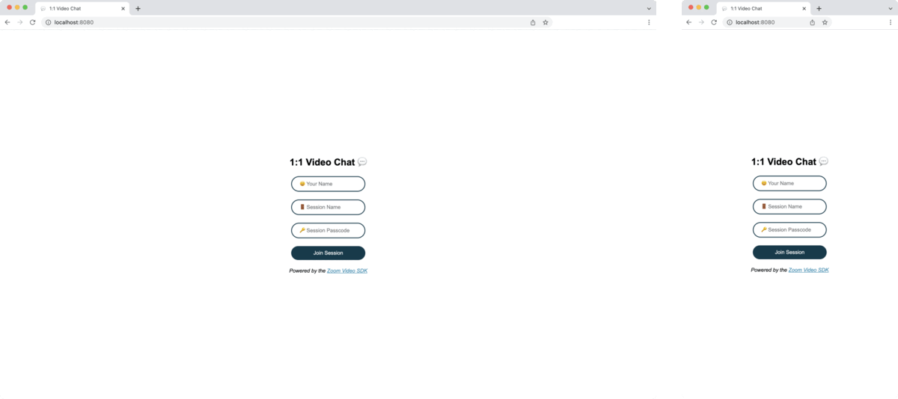

# 1:1 Video Chat 💬

---

Use of this sample app is subject to our [Terms of Use](https://zoom.us/docs/en-us/zoom_api_license_and_tou.html).

This repo is an HTML / CSS / JavaScript website that uses the [Zoom Video SDK](https://marketplace.zoom.us/docs/sdk/video/web) to power 1:1 Video Chats.



## Installation

To get started, clone the repo:

`$ git clone https://github.com/zoom/1-1-video-chat.git`

## Setup

1. Once cloned, navigate to the `1-1-video-chat` directory:

   `$ cd 1-1-video-chat`

1. [Get a signature endpoint URL here.](https://github.com/zoom/videosdk-sample-signature-node.js)

1. Open the `1-1-video-chat-sample` directory in your code editor.

1. Open the `scripts.js` file, and add your signature endpoint URL as the value for the `signatureEndpoint` variable. Example:

   ```js
   let signatureEndpoint = 'https://abc123.herokuapp.com'
   ```

1. Save `scripts.js`.

## Usage

1. Navigate to index.html in your browser ([or serve over localhost](https://www.npmjs.com/package/http-server)) and click "Join Session".

   > The sample app provides default values for the user's name, the session name, and the session passcode. You can fill in the inputs to join a specific session.

   

## Deployment


The 1:1 Video Chat Sample App can be easily deployed to [GitHub Pages](https://github.com/zoom/meetingsdk-sample-javascript#github-pages), or [another static web hosting service](https://github.com/zoom/meetingsdk-sample-javascript#other-static-web-hosting), like an AWS S3 bucket.

### Github Pages

1. Create a repo on [GitHub](https://github.com).

1. Add the remote to your project:

   `$ git remote add origin GITHUB_URL/GITHUB_USERNAME/GITHUB_REPO_NAME.git`

1. Git add, commit, and push your project:

   `$ git add -A`

   `$ git commit -m "deploying to github"`

   `$ git push origin master`

1. On GitHub, in your repo, navigate to the "settings" page, scroll down to the "GitHub Pages" section, and choose the "master branch folder" for the source.

1. Now your project will be deployed to https://GITHUB_USERNAME.github.io/GITHUB_REPO_NAME.

### Other Static Web Hosting

1. Deploy the directory to a static web hosting service, like an AWS S3 bucket.

## Need help?

If you're looking for help, try [Developer Support](https://devsupport.zoom.us) or our [Developer Forum](https://devforum.zoom.us). Priority support is also available with [Premier Developer Support](https://zoom.us/docs/en-us/developer-support-plans.html) plans.
